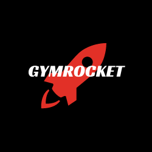
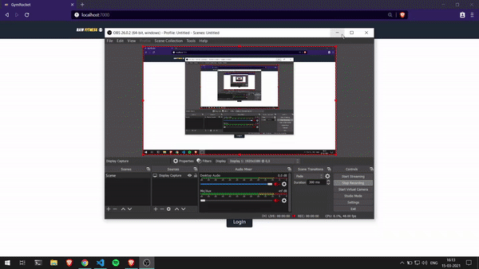

<p align="center"></p>
<h1 align="center">💪 GymRocket</h1>
<p align="center">The open source manager app specifically designed for gymnasiums.</p>
<p align="center">


<a href="https://github.com/AnimeshRy/gymrocket/issues"></a>
<a href="https://github.com/AnimeshRy/gymrocket/network"></a>


<p align="center">
    <a href="https://youtu.be/rCxIc5Z1YAA">
  
    </a>
</p>

## ⚡ Features

🎯 **Dashboard** - Analytics on Member and Payment Data.


🎯 **Member Manager** - Create, Read, Update, Delete Member Data


🎯  **Minimal and Sleek UI** - Elegant Responsive Tailwind User Interface
  

🎯 **Generate Reports and Import as CSV** - Generate CSV with Member Data for external use.


## 🚀 Setup

These instructions will get you a copy of the project up and running on your local machine for deployement and development.

You'll need [Git](https://git-scm.com) and [Python 3.5+](https://www.python.org/downloads/) installed on your local computer.

```
python@3.6 or higher
git@2.17.1 or higher
```

You can also use the [Zip](https://github.com/AnimeshRy/gymrocket/archive/master.zip) file and extract the folder.

## 🔧 How To Use 

From your command line, clone and deploy:

```bash
# Clone this repository
$ git clone https://github.com/AnimeshRy/gymrocket

# Go into the repository
$ cd gymrocket

# Install dependencies
# if Pipenv available ? run
$ pipenv install

# Else
$ pip install -r requirements.txt

```

## 📨 Environment Setup 
```bash
# You'll need some environment variables to setup.
touch .env
# replace string with a random string
SECRET_KEY={string}
DEBUG=True
```

## 🛠️ Django Setup
After installing the requirements, we'll need to setup some Django commands.


### Perform database migration:
```bash
python manage.py check
python manage.py migrate
```
### Create Admin Account
> This is the manager account and only this user can login.
```bash
python manage.py createsuperuser
# follow instruction 
```

### Run Development Server
```bash
python manage.py runserver
```
Navigate to [http://localhost:8000/](http://localhost:8000/) endpoint in your browser.

Admin endpoint is at http://127.0.0.1:8000/admin/

## 👨‍💻 Technologies used

### Frontend 

- [Tailwind](https://tailwindcss.com/) for CSS
- [Chart JS](https://www.chartjs.org/) for Analytics
- [Tailwind UI](https://tailwindui.com/components) for prepared components

### Backend
- [Django 3](https://docs.djangoproject.com/en/3.1/releases/3.0/)
- [SQLite3](https://www.sqlite.org/index.html) as database

## 📄 License

This project is licensed under the MIT License - see the [LICENSE.md](./LICENSE) file for details


## For the Future 
If you want to **contribute** and make this much better for people, you are open to fork and develop it as your own.

- Notification System
- Fitness Plans


#### Designed & Developed with 💙 by [Animesh Singh](https://www.github.com/AnimeshRy)
